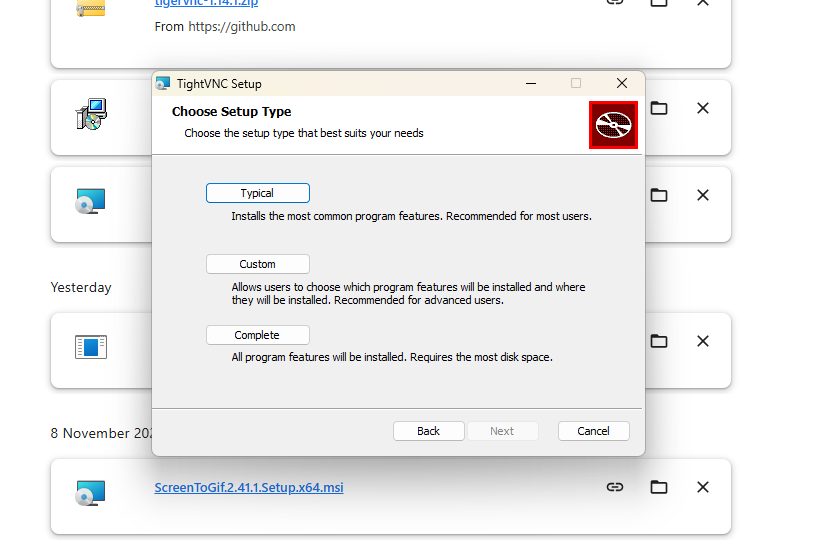
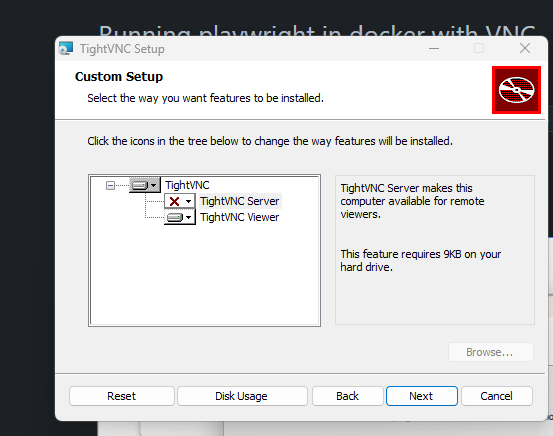
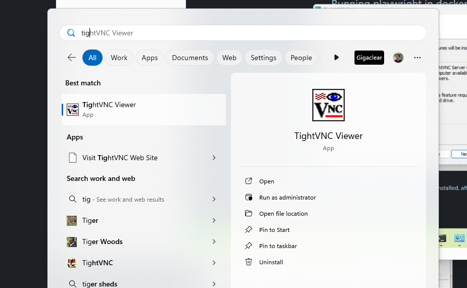
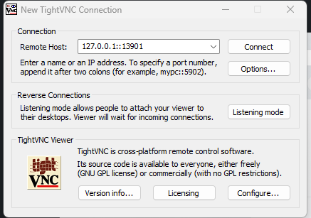
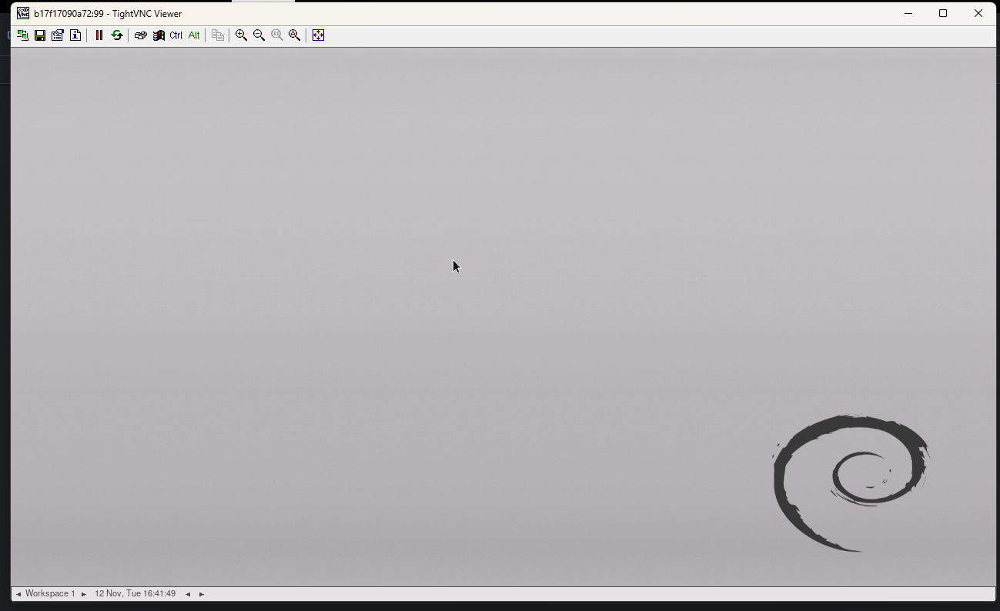
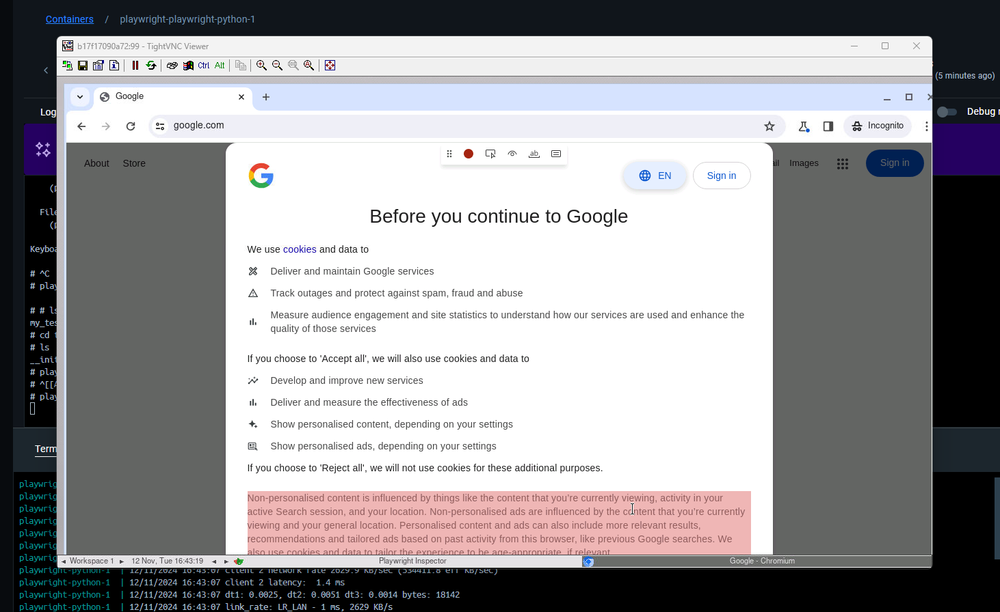

# Playwright VNC Docker

Docker image for running Playwright tests with VNC support, allowing both headless execution in CI/CD and headed mode for local development/debugging. Particularly useful for Windows + WSL users who want to avoid complex local Playwright setup.

## Features

- Pre-installed Playwright with Chrome, Firefox, and WebKit browsers
- VNC server for visual access to browser sessions
- Support for both headless (CI/CD) and headed (local development) modes
- Test recording capability through VNC
- Volume mounting for local test development

## Quick Start

1. Pull the Docker image:
```bash
docker pull prudnikov21/playwright_vnc:latest
```

2. Start the container:
```bash
docker-compose up --build
```

## Running Tests

Execute tests in headed mode:
```bash
docker-compose exec playwright-python pytest tests/test_example.py --headed -v
```

Record new test by interacting with the browser through VNC:
```bash
docker-compose exec playwright-python python -m playwright codegen --target python -o tests/test_example.py
```

## VNC Client Setup

### Linux
Install TigerVNC viewer:
```bash
sudo apt-get install tigervnc-viewer
```
Connect using:
```bash
vncviewer localhost:13901
```

### Windows

1. Download and install [TightVNC Viewer](https://www.tightvnc.com/download.php)

2. During installation, use Custom Setup to deselect the VNC Server component - you only need the viewer for connecting to the Docker container.




3. After installation completes, launch TightVNC Viewer from the Start menu



4. Enter 127.0.0.1::13901 as the remote host address and click Connect



5. You should now see the Docker container's display:


6. You can now run Playwright tests in headed mode or use the record feature:



## Environment Variables

- `DISPLAY`: X11 display configuration (default: `:99`)
- `PYTHONUNBUFFERED`: Python output buffering (default: `1`)
